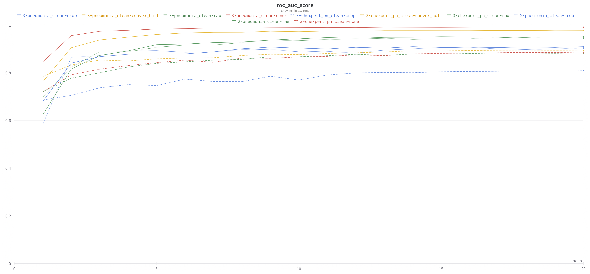

# An Emperical Evaluation of Reducing Spurious Signals in Chest X-Rays via Non-ROI Masking

[Weights and Biases Project](https://wandb.ai/basedrhys/ml4h)

[Full Report](https://drive.google.com/file/d/1XB_jxtC2HqRp0ic8NvW7ChnIDJYAwKkv/view?usp=sharing)

### Contents

* `0-seg_train.ipynb` - Train the lung segmentation model
* `1-seg_apply.py` - Create masks for a classification dataset via the segmentation model
* `2-smooth_masks.py` - Postprocess the predicted lung masks to smooth them out
* `3-create_chexpert.ipynb` - Create the binary classification version of CheXpert
* `3-create_datasets.py` - Apply the smoothed masks and create train/val/test splits of classification dataset
* `4-clf_train.ipynb` - Train the downstream classification model
* `4-clf_train.py` - Train the downstream classification model
* `5-eval.py` - Evaluate the trained classification models
